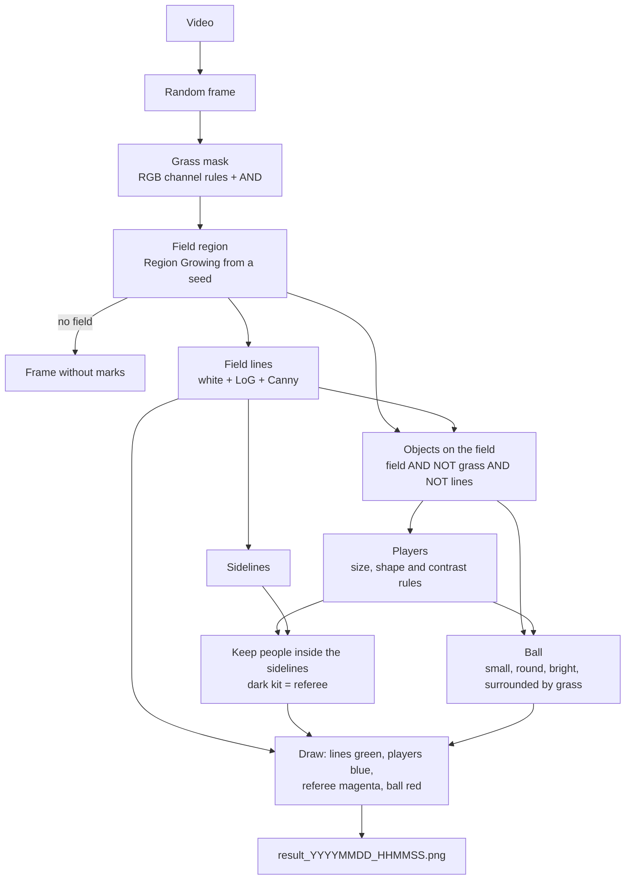

# El Ojo del Árbitro Digital

Class assignment (trabajo práctico) for the Computer Vision course (Visión Computacional).

The notebook takes a random frame from a football match video and marks players in blue, the ball in red and the field lines in green. The referee is marked in magenta, and people outside the sidelines are not marked. Anything that is not in the frame is left unmarked.

## Assignment

Build a computer vision system in Google Colab that processes a football match video, takes a random frame and highlights the key elements of the game when they appear in it:

- Players: a blue contour around each detected player. Individual tracking is not needed.
- Ball: a red contour around the ball, if it is in the frame.
- Field limits: the field lines (sidelines, goal lines, boxes) highlighted in green.

If none of the elements appear in the frame, nothing is marked. The work is graded on the correct use of the algorithms seen in class (edge detection, color filtering, segmentation) and on delivering a working Colab with the video used. Each team works with a different video.

## Architecture

## How to run

1. Download the video (see [Video](#video)), convert it to H.264 and upload it to your Google Drive.
2. Open `Ojo_del_Arbitro_Digital.ipynb` in Google Colab.
3. The notebook expects the video at `My Drive/Colab Notebooks/partidoArgVsBrasil_h264.mp4`. If you put it somewhere else, change `VIDEO_PATH`. Then run all cells.

Each run saves the result as `result_YYYYMMDD_HHMMSS.png` in the same Drive folder as the video. Set `SEED` to a number to repeat the same frame.

## How it was built

Only techniques seen in class are used: color filtering on the RGB channels, binary masks and logical operations, Gaussian and mean filters, LoG, Canny and Region Growing. OpenCV is used to read the video and to find and draw contours.

- Grass: green has to exceed red and blue by a margin. Pixels that are too bright, too blue or too red are excluded, so the ball, Brazil's yellow shirt and the goalkeeper's neon kit don't count as grass.
- Field: Region Growing (4-connectivity) from three seeds near the bottom keeps only the pitch, not green billboards or stands. If the region is too small, or it neither reaches the bottom edge nor crosses the frame side to side, the frame is not a game shot and nothing is drawn. The broadcast logo and scoreboard are masked out.
- Lines: light pixels that are also thin (negative LoG) and close to a Canny edge. Short or thick regions are dropped.
- Players: what is on the field and is neither grass nor line, joined with a few mask growing passes and filtered by height, area, shape and contrast (a flat patch of grass is not a player). The outline is grown a few pixels so it doesn't cut the player.
- Outside the pitch and referee: the sidelines are the long lines that cross most of the frame. A person whose feet are below the near sideline or above the far one is not marked. A person whose region is mostly dark is the referee (all-black kit) and gets a magenta contour.
- Ball: a small, round, bright region surrounded by grass, not touching a line or a player.

All thresholds are in the `P` dictionary at the top of the notebook. They were tuned on random frames of this video.

## Video

Argentina vs Brazil: https://www.youtube.com/watch?v=Uk9ud7UXJYM&t=24s

The video is not in the repo because of its size. The download was AV1, which OpenCV can't read, so it was converted to H.264 (720p) with ffmpeg.

## Tests

`tests/test_1`, `tests/test_2` and `tests/test_3` each have the output for 30 random frames of the video, from successive versions of the code.
